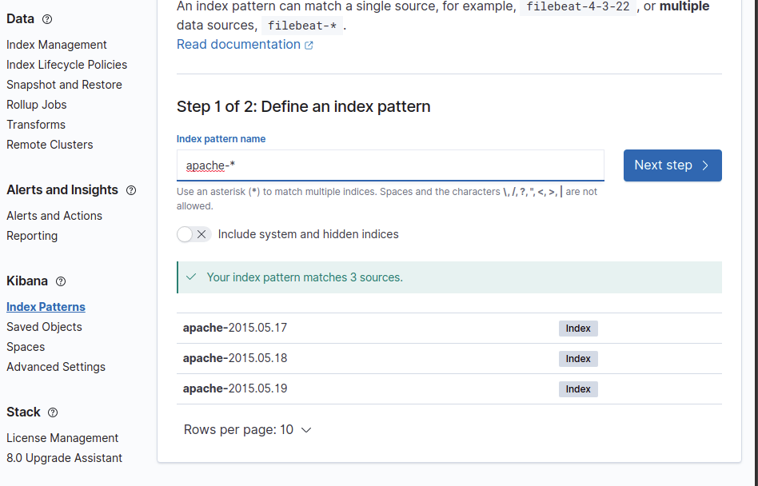
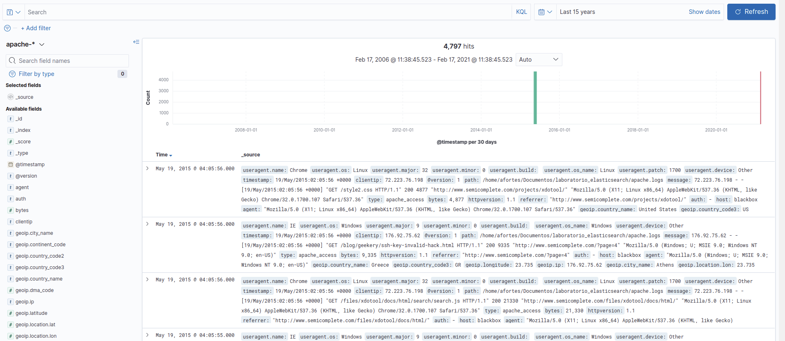

## Laboratorio Logstash

### Laboratorio 1 - Instalación Introducción&Configuración

#### Requisitos


#### Objetivos

  * Realizar una instalación de logstash

#### Ejercicios
##### Instalación Logstash. Parte 1

Vamos a realizar las instalación de una instancia de logstash.

Recursos: https://www.elastic.co/guide/en/logstash/current/installing-logstash.html
Para otras distribuciones consultar el enlance anterior.


*Ejemplo instalación para Rhel&Centos*

1. Descargamos e instalamos la Public Key de elasticsearch

  ```bash
    sudo rpm --import https://artifacts.elastic.co/GPG-KEY-elasticsearch
  ```

2. Añadimos el respositorio yum al path `/etc/yum.repos.d/` como `logstash.repo`

  ```bash
    [logstash-7.x]
    name=Elastic repository for 7.x packages
    baseurl=https://artifacts.elastic.co/packages/7.x/yum
    gpgcheck=1
    gpgkey=https://artifacts.elastic.co/GPG-KEY-elasticsearch
    enabled=1
    autorefresh=1
    type=rpm-md
  ```

3. Instalamos Logstash

    ```bash
      sudo yum install logstash
    ```

4. Comprobamos la versión de logstash instalada.

  <details><summary>Solución</summary>

  ```bash
    /usr/share/logstash/bin/logstash --version
  ```

  </details>

##### Creando la primera pipeline. Parte 2

En esta segunda parte vamos a crear nuestra primera pipeline logstash.

###### Ejercicio 1

Para esta primera parte queremos crear una pipelines con las siguientes premisas:

* **Input**: que permita al usuario introducir por pantalla el mensaje `Hola mundo $IP`, siendo la $IP una ip válida.
>https://www.elastic.co/guide/en/logstash/current/plugins-outputs-stdout.html
* **Filter**: Parsear el mensaje que se introduce en el input y geolocalizar la IP.
>https://www.elastic.co/guide/en/logstash/current/plugins-filters-grok.html
>https://grokdebug.herokuapp.com/
>https://www.elastic.co/guide/en/logstash/current/plugins-filters-geoip.html
* **Output**: Sacar la solución por la salida stdout.
>https://www.elastic.co/guide/en/logstash/current/plugins-outputs-stdout.html


  <details><summary>Solución</summary>

  El fichero de configuración de la pipeline `pipelines_geoip.conf`:

  ```bash
    input {
  stdin {}
}

filter 
{
  grok{

  match => {"message" => "%{GREEDYDATA}%{SPACE}%{IP:ip2}"}
  }

  geoip {
   source => "ip2"
   target => "source_ip"
  }

}


output{
  stdout{ codec => rubydebug}
}

  ```

 * **A partir de la versión 8.5 se debe introducir un source y target en geoip, de lo contrario dará error**

  Para realizar la ejecución:

  ```bash
    ➜  laboratorio_elasticsearch git:(master) ✗ s/usr/share/logstash/bin/logstash -f "/etc/logstash/conf.d/lab_pipeline.yml" 
Using bundled JDK: /usr/share/logstash/jdk
WARNING: Could not find logstash.yml which is typically located in $LS_HOME/config or /etc/logstash. You can specify the path using --path.settings. Continuing using the defaults
Could not find log4j2 configuration at path /usr/share/logstash/config/log4j2.properties. Using default config which logs errors to the console
[WARN ] 2024-07-09 10:43:06.261 [main] runner - NOTICE: Running Logstash as superuser is not recommended and won't be allowed in the future. Set 'allow_superuser' to 'false' to avoid startup errors in future releases.
[INFO ] 2024-07-09 10:43:06.268 [main] runner - Starting Logstash {"logstash.version"=>"8.14.1", "jruby.version"=>"jruby 9.4.7.0 (3.1.4) 2024-04-29 597ff08ac1 OpenJDK 64-Bit Server VM 17.0.11+9 on 17.0.11+9 +indy +jit [x86_64-linux]"}
[INFO ] 2024-07-09 10:43:06.269 [main] runner - JVM bootstrap flags: [-Xms1g, -Xmx1g, -Djava.awt.headless=true, -Dfile.encoding=UTF-8, -Djruby.compile.invokedynamic=true, -XX:+HeapDumpOnOutOfMemoryError, -Djava.security.egd=file:/dev/urandom, -Dlog4j2.isThreadContextMapInheritable=true, -Dlogstash.jackson.stream-read-constraints.max-string-length=200000000, -Dlogstash.jackson.stream-read-constraints.max-number-length=10000, -Djruby.regexp.interruptible=true, -Djdk.io.File.enableADS=true, --add-exports=jdk.compiler/com.sun.tools.javac.api=ALL-UNNAMED, --add-exports=jdk.compiler/com.sun.tools.javac.file=ALL-UNNAMED, --add-exports=jdk.compiler/com.sun.tools.javac.parser=ALL-UNNAMED, --add-exports=jdk.compiler/com.sun.tools.javac.tree=ALL-UNNAMED, --add-exports=jdk.compiler/com.sun.tools.javac.util=ALL-UNNAMED, --add-opens=java.base/java.security=ALL-UNNAMED, --add-opens=java.base/java.io=ALL-UNNAMED, --add-opens=java.base/java.nio.channels=ALL-UNNAMED, --add-opens=java.base/sun.nio.ch=ALL-UNNAMED, --add-opens=java.management/sun.management=ALL-UNNAMED, -Dio.netty.allocator.maxOrder=11]
[INFO ] 2024-07-09 10:43:06.271 [main] runner - Jackson default value override `logstash.jackson.stream-read-constraints.max-string-length` configured to `200000000`
[INFO ] 2024-07-09 10:43:06.271 [main] runner - Jackson default value override `logstash.jackson.stream-read-constraints.max-number-length` configured to `10000`
[WARN ] 2024-07-09 10:43:06.402 [LogStash::Runner] multilocal - Ignoring the 'pipelines.yml' file because modules or command line options are specified
[INFO ] 2024-07-09 10:43:06.925 [Api Webserver] agent - Successfully started Logstash API endpoint {:port=>9600, :ssl_enabled=>false}
[INFO ] 2024-07-09 10:43:07.171 [Converge PipelineAction::Create<main>] Reflections - Reflections took 70 ms to scan 1 urls, producing 132 keys and 468 values
[INFO ] 2024-07-09 10:43:07.459 [Converge PipelineAction::Create<main>] javapipeline - Pipeline `main` is configured with `pipeline.ecs_compatibility: v8` setting. All plugins in this pipeline will default to `ecs_compatibility => v8` unless explicitly configured otherwise.
[WARN ] 2024-07-09 10:43:07.481 [[main]-pipeline-manager] grok - ECS v8 support is a preview of the unreleased ECS v8, and uses the v1 patterns. When Version 8 of the Elastic Common Schema becomes available, this plugin will need to be updated
[INFO ] 2024-07-09 10:43:08.654 [[main]-pipeline-manager] databasemanager - By not manually configuring a database path with `database =>`, you accepted and agreed MaxMind EULA. For more details please visit https://www.maxmind.com/en/geolite2/eula
[INFO ] 2024-07-09 10:43:08.654 [[main]-pipeline-manager] geoip - Using geoip database {:path=>"/usr/share/logstash/data/geoip_database_management/1720514220/GeoLite2-City.mmdb"}
[INFO ] 2024-07-09 10:43:08.744 [[main]-pipeline-manager] javapipeline - Starting pipeline {:pipeline_id=>"main", "pipeline.workers"=>16, "pipeline.batch.size"=>125, "pipeline.batch.delay"=>50, "pipeline.max_inflight"=>2000, "pipeline.sources"=>["/etc/logstash/conf.d/lab_pipeline.yml"], :thread=>"#<Thread:0x99c9a16 /usr/share/logstash/logstash-core/lib/logstash/java_pipeline.rb:134 run>"}
[INFO ] 2024-07-09 10:43:09.296 [[main]-pipeline-manager] javapipeline - Pipeline Java execution initialization time {"seconds"=>0.55}
[INFO ] 2024-07-09 10:43:09.329 [[main]-pipeline-manager] javapipeline - Pipeline started {"pipeline.id"=>"main"}
The stdin plugin is now waiting for input:
[INFO ] 2024-07-09 10:43:09.341 [Agent thread] agent - Pipelines running {:count=>1, :running_pipelines=>[:main], :non_running_pipelines=>[]}
Hola 88.0.209.68
{
      "@version" => "1",
        "source" => {
        "geo" => {
              "continent_code" => "EU",
            "country_iso_code" => "ES",
                 "region_name" => "Ciudad Real",
                "country_name" => "Spain",
                 "postal_code" => "13500",
                    "timezone" => "Europe/Madrid",
             "region_iso_code" => "ES-CR",
                    "location" => {
                "lon" => -4.1025,
                "lat" => 38.6915
            },
                   "city_name" => "Puertollano"
        },
         "ip" => "88.0.209.68"
    },
    "@timestamp" => 2024-07-09T08:43:14.006713782Z,
         "event" => {
        "original" => "Hola 88.0.209.68"
    },
           "ip2" => "88.0.209.68",
       "message" => "Hola 88.0.209.68",
          "host" => {
        "hostname" => "datadope"
    }
}
  ```
  </details>


###### Ejercicio 2

Partiendo de la pipeline que acabamos de crear añadir:

* **Input**: Pasar en el mensaje `Hola mundo $IP $TIMESTAMP`, siendo $TIMESTAMP un formato fecha ISO8601. Ejemplo: `Hola mundo 95.121.15.62 2011-04-19T03:44:01.103Z`
>https://www.elastic.co/guide/en/logstash/current/plugins-filters-date.html
* **Filter**: Parsear la fecha introducida y setearla en el field `@timestamp`.
>https://www.elastic.co/guide/en/logstash/current/plugins-filters-grok.html
>https://grokdebug.herokuapp.com/
>https://www.elastic.co/guide/en/logstash/current/plugins-filters-geoip.html


  <details><summary>Solución</summary>

  El fichero de configuración de la pipeline `pipelines_geoip.conf`:

  ```bash
    input {
      stdin {}
    }
    filter {
      grok {
        match => {"message" => "%{IP:ip} %{TIMESTAMP_ISO8601:fecha}"}
      }
      geoip {
        source => "ip"
      }
      date {
        match => ["fecha", "ISO8601"]
      }
    }
    output {
      stdout {
        codec => rubydebug
      }
    }
  ```

  Ejecución

  ```bash
    ➜  laboratorio_elasticsearch git:(master) ✗ /usr/share/logstash/bin/logstash -f "/etc/logstash/conf.d/lab_pipeline.yml" 
Using bundled JDK: /usr/share/logstash/jdk
WARNING: Could not find logstash.yml which is typically located in $LS_HOME/config or /etc/logstash. You can specify the path using --path.settings. Continuing using the defaults
Could not find log4j2 configuration at path /usr/share/logstash/config/log4j2.properties. Using default config which logs errors to the console
[WARN ] 2024-07-09 10:47:41.535 [main] runner - NOTICE: Running Logstash as superuser is not recommended and won't be allowed in the future. Set 'allow_superuser' to 'false' to avoid startup errors in future releases.
[INFO ] 2024-07-09 10:47:41.546 [main] runner - Starting Logstash {"logstash.version"=>"8.14.1", "jruby.version"=>"jruby 9.4.7.0 (3.1.4) 2024-04-29 597ff08ac1 OpenJDK 64-Bit Server VM 17.0.11+9 on 17.0.11+9 +indy +jit [x86_64-linux]"}
[INFO ] 2024-07-09 10:47:41.549 [main] runner - JVM bootstrap flags: [-Xms1g, -Xmx1g, -Djava.awt.headless=true, -Dfile.encoding=UTF-8, -Djruby.compile.invokedynamic=true, -XX:+HeapDumpOnOutOfMemoryError, -Djava.security.egd=file:/dev/urandom, -Dlog4j2.isThreadContextMapInheritable=true, -Dlogstash.jackson.stream-read-constraints.max-string-length=200000000, -Dlogstash.jackson.stream-read-constraints.max-number-length=10000, -Djruby.regexp.interruptible=true, -Djdk.io.File.enableADS=true, --add-exports=jdk.compiler/com.sun.tools.javac.api=ALL-UNNAMED, --add-exports=jdk.compiler/com.sun.tools.javac.file=ALL-UNNAMED, --add-exports=jdk.compiler/com.sun.tools.javac.parser=ALL-UNNAMED, --add-exports=jdk.compiler/com.sun.tools.javac.tree=ALL-UNNAMED, --add-exports=jdk.compiler/com.sun.tools.javac.util=ALL-UNNAMED, --add-opens=java.base/java.security=ALL-UNNAMED, --add-opens=java.base/java.io=ALL-UNNAMED, --add-opens=java.base/java.nio.channels=ALL-UNNAMED, --add-opens=java.base/sun.nio.ch=ALL-UNNAMED, --add-opens=java.management/sun.management=ALL-UNNAMED, -Dio.netty.allocator.maxOrder=11]
[INFO ] 2024-07-09 10:47:41.551 [main] runner - Jackson default value override `logstash.jackson.stream-read-constraints.max-string-length` configured to `200000000`
[INFO ] 2024-07-09 10:47:41.551 [main] runner - Jackson default value override `logstash.jackson.stream-read-constraints.max-number-length` configured to `10000`
[WARN ] 2024-07-09 10:47:41.704 [LogStash::Runner] multilocal - Ignoring the 'pipelines.yml' file because modules or command line options are specified
[INFO ] 2024-07-09 10:47:42.186 [Api Webserver] agent - Successfully started Logstash API endpoint {:port=>9600, :ssl_enabled=>false}
[INFO ] 2024-07-09 10:47:42.495 [Converge PipelineAction::Create<main>] Reflections - Reflections took 84 ms to scan 1 urls, producing 132 keys and 468 values
[INFO ] 2024-07-09 10:47:42.818 [Converge PipelineAction::Create<main>] javapipeline - Pipeline `main` is configured with `pipeline.ecs_compatibility: v8` setting. All plugins in this pipeline will default to `ecs_compatibility => v8` unless explicitly configured otherwise.
[WARN ] 2024-07-09 10:47:42.832 [[main]-pipeline-manager] grok - ECS v8 support is a preview of the unreleased ECS v8, and uses the v1 patterns. When Version 8 of the Elastic Common Schema becomes available, this plugin will need to be updated
[INFO ] 2024-07-09 10:47:44.374 [[main]-pipeline-manager] databasemanager - By not manually configuring a database path with `database =>`, you accepted and agreed MaxMind EULA. For more details please visit https://www.maxmind.com/en/geolite2/eula
[INFO ] 2024-07-09 10:47:44.374 [[main]-pipeline-manager] geoip - Using geoip database {:path=>"/usr/share/logstash/data/geoip_database_management/1720514220/GeoLite2-City.mmdb"}
[INFO ] 2024-07-09 10:47:44.458 [[main]-pipeline-manager] javapipeline - Starting pipeline {:pipeline_id=>"main", "pipeline.workers"=>16, "pipeline.batch.size"=>125, "pipeline.batch.delay"=>50, "pipeline.max_inflight"=>2000, "pipeline.sources"=>["/etc/logstash/conf.d/lab_pipeline.yml"], :thread=>"#<Thread:0x51379d6e /usr/share/logstash/logstash-core/lib/logstash/java_pipeline.rb:134 run>"}
[INFO ] 2024-07-09 10:47:45.063 [[main]-pipeline-manager] javapipeline - Pipeline Java execution initialization time {"seconds"=>0.6}
[INFO ] 2024-07-09 10:47:45.088 [[main]-pipeline-manager] javapipeline - Pipeline started {"pipeline.id"=>"main"}
The stdin plugin is now waiting for input:
[INFO ] 2024-07-09 10:47:45.099 [Agent thread] agent - Pipelines running {:count=>1, :running_pipelines=>[:main], :non_running_pipelines=>[]}
Hola 88.0.209.68 2024-07-09T08:48:21+0000
{
           "ip2" => "88.0.209.68",
        "source" => {
         "ip" => "88.0.209.68",
        "geo" => {
                    "location" => {
                "lon" => -4.1025,
                "lat" => 38.6915
            },
                "country_name" => "Spain",
                 "postal_code" => "13500",
             "region_iso_code" => "ES-CR",
                 "region_name" => "Ciudad Real",
                   "city_name" => "Puertollano",
                    "timezone" => "Europe/Madrid",
              "continent_code" => "EU",
            "country_iso_code" => "ES"
        }
    },
         "fecha" => "2024-07-09T08:48:21+0000",
       "message" => "Hola 88.0.209.68 2024-07-09T08:48:21+0000",
    "@timestamp" => 2024-07-09T08:48:21.000Z,
      "@version" => "1",
          "host" => {
        "hostname" => "datadope"
    },
         "event" => {
        "original" => "Hola 88.0.209.68 2024-07-09T08:48:21+0000"
    }
}
^C[WARN ] 2024-07-09 10:48:46.254 [SIGINT handler] runner - SIGINT received. Shutting down.
[INFO ] 2024-07-09 10:48:46.326 [[main]-pipeline-manager] javapipeline - Pipeline terminated {"pipeline.id"=>"main"}
[INFO ] 2024-07-09 10:48:47.267 [Converge PipelineAction::StopAndDelete<main>] pipelinesregistry - Removed pipeline from registry successfully {:pipeline_id=>:main}
[INFO ] 2024-07-09 10:48:47.272 [LogStash::Runner] runner - Logstash shut down.

  ```
  </details>


### Laboratorio 2 - Trabajando con inputs, filters y outputs

#### Requisitos

  * Logstash

#### Objetivos

  * Conocer y trabajar con el input file de logstash.
  * Saber como procesar ficheros de texto vía logstash.
  * Aplicar patrones grok a ficheros de aplicación reales.
  * Configurar filter date.
  * Configurar filter geoip.
  * Aprender a procesar useragent

#### Preparación de set de datos

1. Lo primero que realizarmos es descargarnos los logs de ejemplso apache que tendremos que procesar

  ```bash
    wget https://raw.githubusercontent.com/elastic/examples/master/Common%20Data%20Formats/apache_logs/apache_logs --output-document apache.logs
  ```

#### Ejercicios
##### Ejercicio:1 Procesando logs de apache.

El objetivo de este ejercicio es procesar el set de datos de ejemplo, logs de apache previamente descargados, con logstash que separemos cada campo del log el fields distintos.

Una vez tengamos cada traza de logs debidamente categorizada debemos setear el timestamp de cada traza de log como @timestamp para que el tiempo se categorice correctamente.

Por otro lado debemos geolocalizar la ip que viene en cada traza del log.

Debemos parsear el user agent que viene en los logs de forma que podamos analizar sobre que navegador se ha ejecutado la petición.

Por último debemos ejecutar la pipelines y que se muestren todos los resultados por stdout.

  <details><summary>Solución</summary>

  El fichero de configuración de la pipeline `lab_pipeline.conf`:

  ```bash
    input {
  file {

    path => ["/home/datadope/Documentos/Lab_elastic/apache.logs"]

    start_position => "beginning"
    mode => "read"
  }
}

filter 
{
  grok{

  match => {
"message" => '%{IP:source.ip} %{DATA:client_machine} %{DATA:user.name} \[%{HTTPDATE:timestamp}\] "%{WORD:http.method} %{NOTSPACE:url.original} HTTP/%{DATA:http.version}" %{NUMBER:http.response.status} (?:-|%{NUMBER:http.response.body_bytes}) "%{DATA:http.request.referrer}" "%{DATA:user.agent}"'

 }

  }
  geoip {
   source => "source.ip"
   target => "source_ip"
  }

date{

match => [ timestamp, "dd/MMM/yyyy:HH:mm:ss Z"]

}


}


output{
 stdout{ codec => rubydebug}
 # elasticsearch{
 #   hosts => ["172.18.1.3:9200", "172.18.1.2:9200", "172.18.1.4:9200"]
 #   index => "apache-%{+YYYY-MM-dd}"
 # }
}
  ```

  Ejecución

  ```bash
    ➜  laboratorio_elasticsearch git:(master) ✗ /usr/share/logstash/bin/logstash -f "/etc/logstash/conf.d/lab_pipeline.yml
    {[INFO ] 2024-07-09 11:33:06.158 [Agent thread] agent - Pipelines running {:count=>1, :running_pipelines=>[:main], :non_running_pipelines=>[]}
{
                         "log" => {
        "file" => {
            "path" => "/home/datadope/Documentos/Lab_elastic/apache.logs"
        }
    },
                 "http.method" => "GET",
                   "timestamp" => "17/May/2015:10:05:24 +0000",
                  "@timestamp" => 2015-05-17T10:05:24.000Z,
                   "user.name" => "-",
                        "host" => {
        "name" => "datadope"
    },
                "http.version" => "1.1",
                   "source.ip" => "83.149.9.216",
                       "event" => {
        "original" => "83.149.9.216 - - [17/May/2015:10:05:24 +0000] \"GET /presentations/logstash-monitorama-2013/images/frontend-response-codes.png HTTP/1.1\" 200 52878 \"http://semicomplete.com/presentations/logstash-monitorama-2013/\" \"Mozilla/5.0 (Macintosh; Intel Mac OS X 10_9_1) AppleWebKit/537.36 (KHTML, like Gecko) Chrome/32.0.1700.77 Safari/537.36\""
    },
       "http.request.referrer" => "http://semicomplete.com/presentations/logstash-monitorama-2013/",
                    "@version" => "1",
        "http.response.status" => "200",
                  "user.agent" => "Mozilla/5.0 (Macintosh; Intel Mac OS X 10_9_1) AppleWebKit/537.36 (KHTML, like Gecko) Chrome/32.0.1700.77 Safari/537.36",
                     "message" => "83.149.9.216 - - [17/May/2015:10:05:24 +0000] \"GET /presentations/logstash-monitorama-2013/images/frontend-response-codes.png HTTP/1.1\" 200 52878 \"http://semicomplete.com/presentations/logstash-monitorama-2013/\" \"Mozilla/5.0 (Macintosh; Intel Mac OS X 10_9_1) AppleWebKit/537.36 (KHTML, like Gecko) Chrome/32.0.1700.77 Safari/537.36\"",
              "client_machine" => "-",
                "url.original" => "/presentations/logstash-monitorama-2013/images/frontend-response-codes.png",
    "http.response.body_bytes" => "52878",
                   "source_ip" => {
        "geo" => {
                 "postal_code" => "102090",
                    "location" => {
                "lon" => 37.6171,
                "lat" => 55.7483
            },
              "continent_code" => "EU",
                    "timezone" => "Europe/Moscow",
                "country_name" => "Russia",
             "region_iso_code" => "RU-MOW",
                 "region_name" => "Moscow",
                   "city_name" => "Moscow",
            "country_iso_code" => "RU"
        },
         "ip" => "83.149.9.216"
    }
}
{
                         "log" => {
        "file" => {
            "path" => "/home/datadope/Documentos/Lab_elastic/apache.logs"
        }
    },
                 "http.method" => "GET",
                   "timestamp" => "17/May/2015:10:05:14 +0000",
                  "@timestamp" => 2015-05-17T10:05:14.000Z,
                   "user.name" => "-",
                        "host" => {
        "name" => "datadope"
    },
                "http.version" => "1.1",
                   "source.ip" => "93.114.45.13",
                       "event" => {
        "original" => "93.114.45.13 - - [17/May/2015:10:05:14 +0000] \"GET /articles/dynamic-dns-with-dhcp/ HTTP/1.1\" 200 18848 \"http://www.google.ro/url?sa=t&rct=j&q=&esrc=s&source=web&cd=2&ved=0CCwQFjAB&url=http%3A%2F%2Fwww.semicomplete.com%2Farticles%2Fdynamic-dns-with-dhcp%2F&ei=W88AU4n9HOq60QXbv4GwBg&usg=AFQjCNEF1X4Rs52UYQyLiySTQxa97ozM4g&bvm=bv.61535280,d.d2k\" \"Mozilla/5.0 (X11; Linux x86_64; rv:25.0) Gecko/20100101 Firefox/25.0\""
    },
       "http.request.referrer" => "http://www.google.ro/url?sa=t&rct=j&q=&esrc=s&source=web&cd=2&ved=0CCwQFjAB&url=http%3A%2F%2Fwww.semicomplete.com%2Farticles%2Fdynamic-dns-with-dhcp%2F&ei=W88AU4n9HOq60QXbv4GwBg&usg=AFQjCNEF1X4Rs52UYQyLiySTQxa97ozM4g&bvm=bv.61535280,d.d2k",
                    "@version" => "1",
        "http.response.status" => "200",
                  "user.agent" => "Mozilla/5.0 (X11; Linux x86_64; rv:25.0) Gecko/20100101 Firefox/25.0",
                     "message" => "93.114.45.13 - - [17/May/2015:10:05:14 +0000] \"GET /articles/dynamic-dns-with-dhcp/ HTTP/1.1\" 200 18848 \"http://www.google.ro/url?sa=t&rct=j&q=&esrc=s&source=web&cd=2&ved=0CCwQFjAB&url=http%3A%2F%2Fwww.semicomplete.com%2Farticles%2Fdynamic-dns-with-dhcp%2F&ei=W88AU4n9HOq60QXbv4GwBg&usg=AFQjCNEF1X4Rs52UYQyLiySTQxa97ozM4g&bvm=bv.61535280,d.d2k\" \"Mozilla/5.0 (X11; Linux x86_64; rv:25.0) Gecko/20100101 Firefox/25.0\"",
              "client_machine" => "-",
                "url.original" => "/articles/dynamic-dns-with-dhcp/",
    "http.response.body_bytes" => "18848",
                   "source_ip" => {
        "geo" => {
                 "postal_code" => "052041",
                    "location" => {
                "lon" => 26.1006,
                "lat" => 44.4291
            },
              "continent_code" => "EU",
                    "timezone" => "Europe/Bucharest",
                "country_name" => "Romania",
             "region_iso_code" => "RO-B",
                 "region_name" => "București",
                   "city_name" => "Bucharest",
            "country_iso_code" => "RO"
        },
         "ip" => "93.114.45.13"
    }
}
    (...)
  ```
  </details>


##### Ejercicio:2 Procesando logs de apache.


Para este ejercicio partiremos de la pipeline anteriormente creada y tendremos que ingestar los documentos en elasticsearch en un indice que llamaremos `apache`.

* Debe crearse un índice apache por día, rotado dirario.

* Cuando realicemos la ingesta debemos mantener la salida por pantalla que hemos creado en el ejercicio anterior en aras de poder debuggar los resultados.

* Crearemos en kibana un index pattern para poder consultar el índice.

* Consultaremos desde kibana -> pestaña de discovery la información que hemos ingestado.

  <details><summary>Solución</summary>

  El fichero de configuración de la pipeline `lab_pipeline.conf`:

  ```bash
    input {
    file {

    path => ["/home/datadope/Documentos/Lab_elastic/apache.logs"]

    start_position => "beginning"
    mode => "read"
    }
    }
    filter 
    {
      grok{

      match => {
    "message" => '%{IP:source.ip} %{DATA:client_machine} %{DATA:user.name} \[%{HTTPDATE:timestamp}\] "%{WORD:http.method} %{NOTSPACE:url.original} HTTP/%{DATA:http.version}" %{NUMBER:http.response.status} (?:-|%{NUMBER:http.response.body_bytes}) "%{DATA:http.request.referrer}" "%{DATA:user.agent}"'

    }

      }
      geoip {
      source => "source.ip"
      target => "source_ip"
      }

    date{

    match => [ timestamp, "dd/MMM/yyyy:HH:mm:ss Z"]
    }
    }
    output{
      stdout{ codec => rubydebug}
      elasticsearch{
        hosts => ["172.18.1.3:9200", "172.18.1.2:9200", "172.18.1.4:9200"]
        index => "apache-%{+YYYY-MM-dd}"
      }
    }
      ```

  Ejecución

  ```bash
    ➜  laboratorio_elasticsearch git:(master) ✗ /usr/share/logstash/bin/logstash -f "/etc/logstash/conf.d/lab_pipeline.yml
      { 
               [INFO ] 2024-07-09 11:33:06.158 [Agent thread] agent - Pipelines running {:count=>1, :running_pipelines=>[:main], :non_running_pipelines=>[]}
              {
                                      "log" => {
                      "file" => {
                          "path" => "/home/datadope/Documentos/Lab_elastic/apache.logs"
                      }
                  },
                              "http.method" => "GET",
                                "timestamp" => "17/May/2015:10:05:24 +0000",
                                "@timestamp" => 2015-05-17T10:05:24.000Z,
                                "user.name" => "-",
                                      "host" => {
                      "name" => "datadope"
                  },
                              "http.version" => "1.1",
                                "source.ip" => "83.149.9.216",
                                    "event" => {
                      "original" => "83.149.9.216 - - [17/May/2015:10:05:24 +0000] \"GET /presentations/logstash-monitorama-2013/images/frontend-response-codes.png HTTP/1.1\" 200 52878 \"http://semicomplete.com/presentations/logstash-monitorama-2013/\" \"Mozilla/5.0 (Macintosh; Intel Mac OS X 10_9_1) AppleWebKit/537.36 (KHTML, like Gecko) Chrome/32.0.1700.77 Safari/537.36\""
                  },
                    "http.request.referrer" => "http://semicomplete.com/presentations/logstash-monitorama-2013/",
                                  "@version" => "1",
                      "http.response.status" => "200",
                                "user.agent" => "Mozilla/5.0 (Macintosh; Intel Mac OS X 10_9_1) AppleWebKit/537.36 (KHTML, like Gecko) Chrome/32.0.1700.77 Safari/537.36",
                                  "message" => "83.149.9.216 - - [17/May/2015:10:05:24 +0000] \"GET /presentations/logstash-monitorama-2013/images/frontend-response-codes.png HTTP/1.1\" 200 52878 \"http://semicomplete.com/presentations/logstash-monitorama-2013/\" \"Mozilla/5.0 (Macintosh; Intel Mac OS X 10_9_1) AppleWebKit/537.36 (KHTML, like Gecko) Chrome/32.0.1700.77 Safari/537.36\"",
                            "client_machine" => "-",
                              "url.original" => "/presentations/logstash-monitorama-2013/images/frontend-response-codes.png",
                  "http.response.body_bytes" => "52878",
                                "source_ip" => {
                      "geo" => {
                              "postal_code" => "102090",
                                  "location" => {
                              "lon" => 37.6171,
                              "lat" => 55.7483
                          },
                            "continent_code" => "EU",
                                  "timezone" => "Europe/Moscow",
                              "country_name" => "Russia",
                          "region_iso_code" => "RU-MOW",
                              "region_name" => "Moscow",
                                "city_name" => "Moscow",
                          "country_iso_code" => "RU"
                      },
                      "ip" => "83.149.9.216"
                  }
              }
              {
                                      "log" => {
                      "file" => {
                          "path" => "/home/datadope/Documentos/Lab_elastic/apache.logs"
                      }
                  },
                              "http.method" => "GET",
                                "timestamp" => "17/May/2015:10:05:14 +0000",
                                "@timestamp" => 2015-05-17T10:05:14.000Z,
                                "user.name" => "-",
                                      "host" => {
                      "name" => "datadope"
                  },
                              "http.version" => "1.1",
                                "source.ip" => "93.114.45.13",
                                    "event" => {
                      "original" => "93.114.45.13 - - [17/May/2015:10:05:14 +0000] \"GET /articles/dynamic-dns-with-dhcp/ HTTP/1.1\" 200 18848 \"http://www.google.ro/url?sa=t&rct=j&q=&esrc=s&source=web&cd=2&ved=0CCwQFjAB&url=http%3A%2F%2Fwww.semicomplete.com%2Farticles%2Fdynamic-dns-with-dhcp%2F&ei=W88AU4n9HOq60QXbv4GwBg&usg=AFQjCNEF1X4Rs52UYQyLiySTQxa97ozM4g&bvm=bv.61535280,d.d2k\" \"Mozilla/5.0 (X11; Linux x86_64; rv:25.0) Gecko/20100101 Firefox/25.0\""
                  },
                    "http.request.referrer" => "http://www.google.ro/url?sa=t&rct=j&q=&esrc=s&source=web&cd=2&ved=0CCwQFjAB&url=http%3A%2F%2Fwww.semicomplete.com%2Farticles%2Fdynamic-dns-with-dhcp%2F&ei=W88AU4n9HOq60QXbv4GwBg&usg=AFQjCNEF1X4Rs52UYQyLiySTQxa97ozM4g&bvm=bv.61535280,d.d2k",
                                  "@version" => "1",
                      "http.response.status" => "200",
                                "user.agent" => "Mozilla/5.0 (X11; Linux x86_64; rv:25.0) Gecko/20100101 Firefox/25.0",
                                  "message" => "93.114.45.13 - - [17/May/2015:10:05:14 +0000] \"GET /articles/dynamic-dns-with-dhcp/ HTTP/1.1\" 200 18848 \"http://www.google.ro/url?sa=t&rct=j&q=&esrc=s&source=web&cd=2&ved=0CCwQFjAB&url=http%3A%2F%2Fwww.semicomplete.com%2Farticles%2Fdynamic-dns-with-dhcp%2F&ei=W88AU4n9HOq60QXbv4GwBg&usg=AFQjCNEF1X4Rs52UYQyLiySTQxa97ozM4g&bvm=bv.61535280,d.d2k\" \"Mozilla/5.0 (X11; Linux x86_64; rv:25.0) Gecko/20100101 Firefox/25.0\"",
                            "client_machine" => "-",
                              "url.original" => "/articles/dynamic-dns-with-dhcp/",
                  "http.response.body_bytes" => "18848",
                                "source_ip" => {
                      "geo" => {
                              "postal_code" => "052041",
                                  "location" => {
                              "lon" => 26.1006,
                              "lat" => 44.4291
                          },
                            "continent_code" => "EU",
                                  "timezone" => "Europe/Bucharest",
                              "country_name" => "Romania",
                          "region_iso_code" => "RO-B",
                              "region_name" => "București",
                                "city_name" => "Bucharest",
                          "country_iso_code" => "RO"
                      },
                      "ip" => "93.114.45.13"
                  }
              }
    (...)
  ```

  Vemos que se ha creado el indice apache con rotación diaría.

  ```bash
    ➜  laboratorio_elasticsearch git:(master) ✗ curl -s -XGET "http://172.18.1.2:9200/_cat/indices"
      green open .internal.alerts-observability.slo.alerts-default-000001           8rOzB3ezRca9VFzNt7EEwA 1 1    0 0   498b  249b  249b
      green open .internal.alerts-observability.apm.alerts-default-000001           SbHDaxkWRZGmZgznHcdOSg 1 1    0 0   498b  249b  249b
      green open .internal.alerts-ml.anomaly-detection-health.alerts-default-000001 ojocTn9oQ3qhTfudwqr6Xw 1 1    0 0   498b  249b  249b
      green open .internal.alerts-security.alerts-default-000001                    iASODSaEQh2mhi-FTJQl9w 1 1    0 0   498b  249b  249b
      green open .internal.alerts-ml.anomaly-detection.alerts-default-000001        xHpHBDlDTXex5RiMgl075A 1 1    0 0   498b  249b  249b
      green open apache-2024-07-09                                                  uGut0inuQJy39-ak3LvPEQ 1 1    1 0 22.1kb  11kb  11kb
      green open .kibana-observability-ai-assistant-kb-000001                       w3vJwivwReGjCNmFqXoDCA 1 1    0 0   498b  249b  249b
      green open .internal.alerts-observability.uptime.alerts-default-000001        ABKlWUr6Tta4ZRu-g9TJ9w 1 1    0 0   498b  249b  249b
      green open apache-2015-05-17                                                  Fg38foKtR7a-2raFyqRxPQ 1 1 1632 0  3.8mb 1.9mb 1.9mb
      green open apache-2015-05-18                                                  FJ97nvE0TsKsDUm_RXzB2Q 1 1 2893 0  5.3mb 2.8mb 2.8mb
      green open apache-2015-05-19                                                  ynRI9U2nQRGym0LGaAStcA 1 1 2896 0  5.5mb 2.7mb 2.7mb
      green open .kibana-observability-ai-assistant-conversations-000001            XoRNDL7nRhCFcVAFrLjUbw 1 1    0 0   498b  249b  249b
      green open .internal.alerts-stack.alerts-default-000001                       vjZ5CQ8zSWasN0TZXE3Urw 1 1    0 0   498b  249b  249b
      green open .internal.alerts-default.alerts-default-000001                     y_OXoKzwR4qSJPwPEQnSyA 1 1    0 0   498b  249b  249b
      green open .internal.alerts-observability.logs.alerts-default-000001          T9rzztJuTfqLxRKbjtYeaA 1 1    0 0   498b  249b  249b
      green open .internal.alerts-transform.health.alerts-default-000001            bW_nl3qHR56wjel5njokBw 1 1    0 0   498b  249b  249b
      green open .internal.alerts-observability.metrics.alerts-default-000001       fPWKp7vNTRyS53lhlPNs3A 1 1    0 0   498b  249b  249b
      green open apache-2015-05-20                                                  wircxyQrQOC-dDvKPMsY8g 1 1 2578 0  5.2mb 2.5mb 2.5mb
      green open .internal.alerts-observability.threshold.alerts-default-000001     v4ARDkW3S2mpkfF728flOQ 1 1    0 0   498b  249b  249b

  ```
  Creamos el index pattern en kibana

  

  Consultamos la pestaña de discovery

  
  </details>
