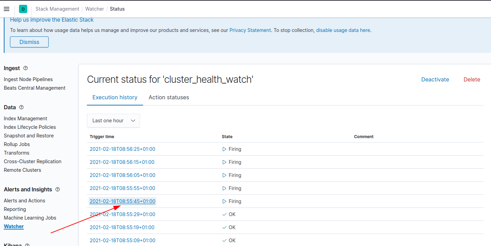

## Laboratorio Watcher Elasticsearch

### Laboratorio Creación de un watcher

#### Requisitos

  * Elasticsearch
  * Kibana 

#### Objetivos

  * Crear nuestro primer watcher en elasticserach.

#### Ejercicio
##### Preparación del entorno

Para poder hacer uso de watcher es necesario activar la licencia gold de elasticsearch. Para poder realizar este laboratorio vamos a activar el trial de 30 días que nos ofrece elasticsearch.

*Activando la versión gold trial de elasticsearch*

1. Desde kibana, en la pestaña stack manag ement -> Licence Management -> Start Trial

  

*Configurar el envío de emails desde elasticsearch* 

1. Añadir la siguiente configuración al fichero `/config/elasticsearch.yml`. 

  Mas info: https://www.elastic.co/guide/en/elasticsearch/reference/current/actions-email.html#gmail

  Si no hemos bindeado un volumen para la configuración de docker accedemos al contenedor y realizamos el cambio

  Repetiremos este procedimiento con cada nodo de elasticsearch
  Se ejecutará primero como root al acceder al container para instalar algún editor de texto, en este caso nano


  ```bash
    docker exec -it -u 0 elasticsearch1 bash
    apt-get update
    apt-get install nano
  ```

  Una vez dentro añadir la configuración al fichero `config/elasticsearch.yml`

  ```bash
    xpack.notification.email.account:
    gmail_account:
        profile: gmail
        smtp:
            auth: true
            starttls.enable: true
            host: smtp.gmail.com
            port: 587
            user: <username>
  ```

  Por último añadir la password de la cuenta correo al keystore, accediendo esta vez como un usuario no root

  ```bash
    docker exec -it elasticsearch1 bash
  ```

  ```bash
    bin/elasticsearch-keystore add xpack.notification.email.account.gmail_account.smtp.secure_password
  ```

  Reiniciar el nodo para aplicar la configuración

  ```bash
    docker restart elasticsearch1
  ```
2. Para permitir el envio de correos vía gmail es necesario que la cuenta de Google genere una password específica para Elastic.

  URL: https://ispgestion.com/configurar-gmail-2022-aplicaciones-menos-seguras/


##### Ejercicio - Creando el primer watcher

Crearemos un watcher que envíe un email cuando el cluster de elasticsearch cambie a un estado distinto a `green`.

El watcher tendrá las siguientes características:

  * El trigger debe estar configurado para checkear la condición del watcher cada 10s.
  * El input debe hacer un checkeo http a la api `cluster/health` que proporciona elasticsearch.
  * La condición debe saltar cuando el estado del cluster sea distinto a `green`.
  * El action debe configurar el envio de un email que ponga `El estado del cluster NO es green`

**Pasos:**

1. Dando el alta el watcher, empezaremos con la parte del trigger

  <details><summary>Solución</summary>

  Construimos el json del watcher

  ```json
    {
      "trigger" : {
        "schedule" : { "interval" : "10s" }
      }
    }
  ```

  Damos de alta el watcher con el trigger usando el json anterior:

  ```bash
    ➜  laboratorio_elasticsearch git:(master) ✗ curl -s -H 'Content-Type: application/json' -XPUT "http://172.18.1.2:9200/_watcher/watch/cluster_health_watch" -d'{"trigger":{"schedule":{"interval":"10s"}}}'
  ```

  Comprobamos si se ha creando el watcher

  ```bash
    ➜  laboratorio_elasticsearch git:(master) ✗ curl -s -XGET "http://172.18.1.2:9200/_watcher/watch/cluster_health_watch" | jq
    {
      "found": true,
      "_id": "cluster_health_watch",
      "_version": 7,
      "_seq_no": 6,
      "_primary_term": 1,
      "status": {
        "state": {
          "active": true,
          "timestamp": "2021-02-18T06:50:41.704Z"
        },
        "last_checked": "2021-02-18T06:51:42.784Z",
        "last_met_condition": "2021-02-18T06:51:42.784Z",
        "actions": {},
        "execution_state": "executed",
        "version": 7
      },
      "watch": {
        "trigger": {
          "schedule": {
            "interval": "10s"
          }
        },
        "input": {
          "none": {}
        },
        "condition": {
          "always": {}
        },
        "actions": {}
      }
    }
  ```
  </details>


2. Updateamos el watcher creado anteriormente y damos de alta la parte del input encargada de realizar el checkeo vía api del estado del cluster.

  <details><summary>Solución</summary>

  Construimos el json del watcher

  ```json
    {
      "trigger" : {
        "schedule" : { "interval" : "10s" }
      },
      "input" : {
        "http" : {
          "request" : {
           "host" : "localhost",
           "port" : 9200,
           "path" : "/_cluster/health"
          }
        }
      }
    }
  ```

  Updateamos el watcher añadiendo el input usando el json anterior

  ```bash
    curl -s -H 'Content-Type: application/json' -XPUT "http://172.18.1.2:9200/_watcher/watch/cluster_health_watch" -d'{"trigger":{"schedule":{"interval":"10s"}},"input":{"http":{"request":{"host":"localhost","port":9200,"path":"/_cluster/health"}}}}'
  ```
  </details>


3. Añadimos la condición

  <details><summary>Solución</summary>

  Construimos el json del watcher

  ```json
    {
      "trigger" : {
        "schedule" : { "interval" : "10s" }
      },
      "input" : {
        "http" : {
          "request" : {
           "host" : "localhost",
           "port" : 9200,
           "path" : "/_cluster/health"
          }
        }
      },
      "condition" : {
        "compare" : {
          "ctx.payload.status" : { "not_eq" : "green" }
        }
      }
    }
  ```

  Updateamos el watcher añadiendo la condición usando el json anterior

  ```bash
    ➜  laboratorio_elasticsearch git:(master) ✗ curl -s -H 'Content-Type: application/json' -XPUT "http://172.18.1.2:9200/_watcher/watch/cluster_health_watch" -d'{"trigger":{"schedule":{"interval":"10s"}},"input":{"http":{"request":{"host":"localhost","port":9200,"path":"/_cluster/health"}}},"condition":{"compare":{"ctx.payload.status":{"not_eq":"green"}}}}'
  ```
  </details>


4. Por último añadimos el action que enviará el email

  <details><summary>Solución</summary>

  Construimos el json del watcher

  ```json
    {
      "trigger" : {
        "schedule" : { "interval" : "10s" }
      },
      "input" : {
        "http" : {
          "request" : {
           "host" : "localhost",
           "port" : 9200,
           "path" : "/_cluster/health"
          }
        }
      },
      "condition" : {
        "compare" : {
          "ctx.payload.status" : { "not_eq" : "green" }
        }
      },
      "actions" : {
        "send_email" : {
          "email" : {
            "to" : "guillermo.navas@datadope.io",
            "subject" : "El estado del cluster NO es green",
            "body" : "El estado del cluster NO es green"
          }
        }
      }
    }
  ```

  Updateamos el watcher añadiendo el action email usando el json anterior

  ```bash
    ➜  laboratorio_elasticsearch git:(master) ✗ curl -s -H 'Content-Type: application/json' -XPUT "http://172.18.1.2:9200/_watcher/watch/cluster_health_watch" -d'{"trigger":{"schedule":{"interval":"10s"}},"input":{"http":{"request":{"host":"localhost","port":9200,"path":"/_cluster/health"}}},"condition":{"compare":{"ctx.payload.status":{"not_eq":"green"}}},"actions":{"send_email":{"email":{"to":"guillermo.navas@datadope.io","subject":"El estado del cluster NO es green","body":"El estado del cluster NO es green"}}}}'
  ```
  </details>

5. Vamos a parar un nodo de datos para que el cluster cambie de estado

  <details><summary>Solución</summary>

  Paramos nodo de datos

  ```bash
  docker stop es02
  ```

  Chequeamos el estado del cluster

  ```bash
    ➜  laboratorio_elasticsearch git:(master) ✗ curl -s -XGET "http://172.18.1.2:9200/_cluster/health?pretty=true" | jq
  {
    "cluster_name": "es-docker-cluster",
    "status": "yellow",
    "timed_out": false,
    "number_of_nodes": 2,
    "number_of_data_nodes": 2,
    "active_primary_shards": 18,
    "active_shards": 24,
    "relocating_shards": 0,
    "initializing_shards": 0,
    "unassigned_shards": 12,
    "delayed_unassigned_shards": 12,
    "number_of_pending_tasks": 0,
    "number_of_in_flight_fetch": 0,
    "task_max_waiting_in_queue_millis": 0,
    "active_shards_percent_as_number": 66.66666666666666
  }
  ```
  </details>

6. Comprobamos desde kibana si el action se ha disparado

  <details><summary>Solución</summary>

  Para debugar si el watcher se ha ejecutado correctamente podemos usar kibana

  
  </details>
